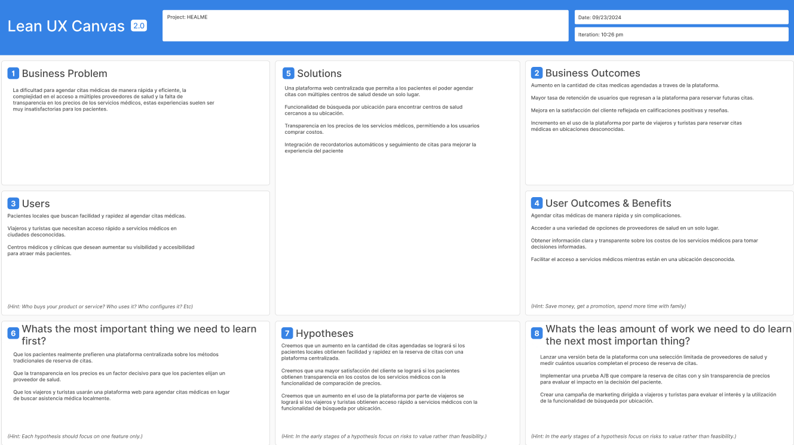
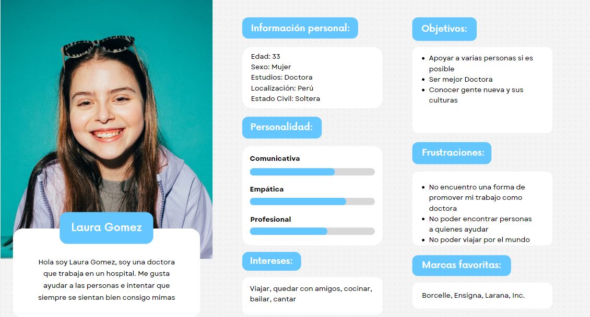
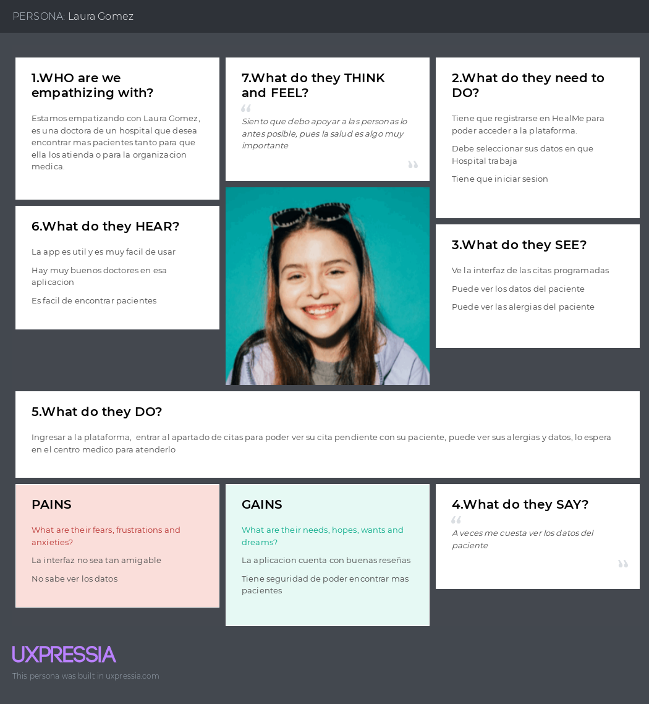
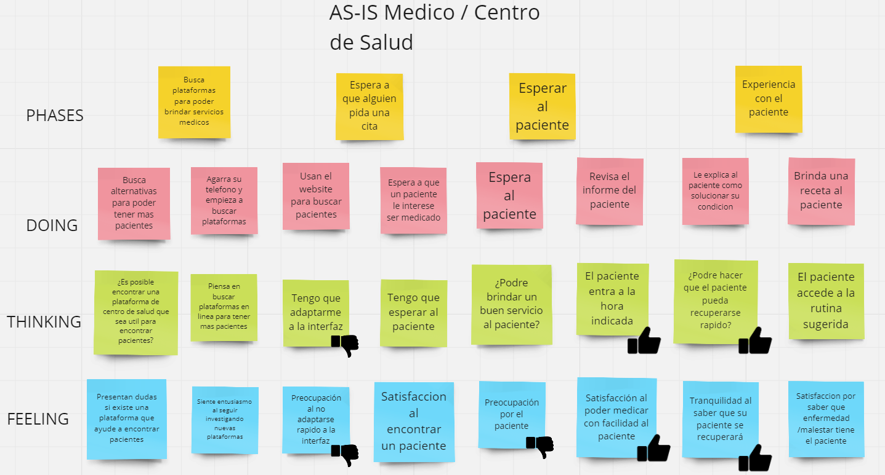
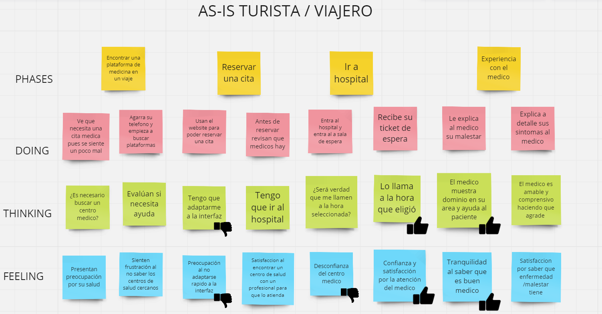
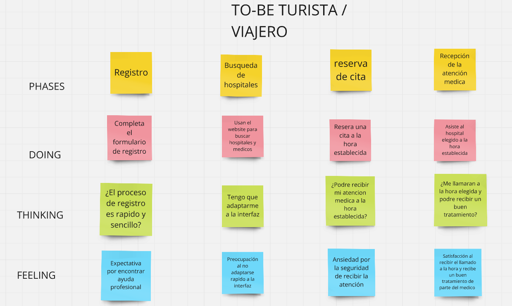
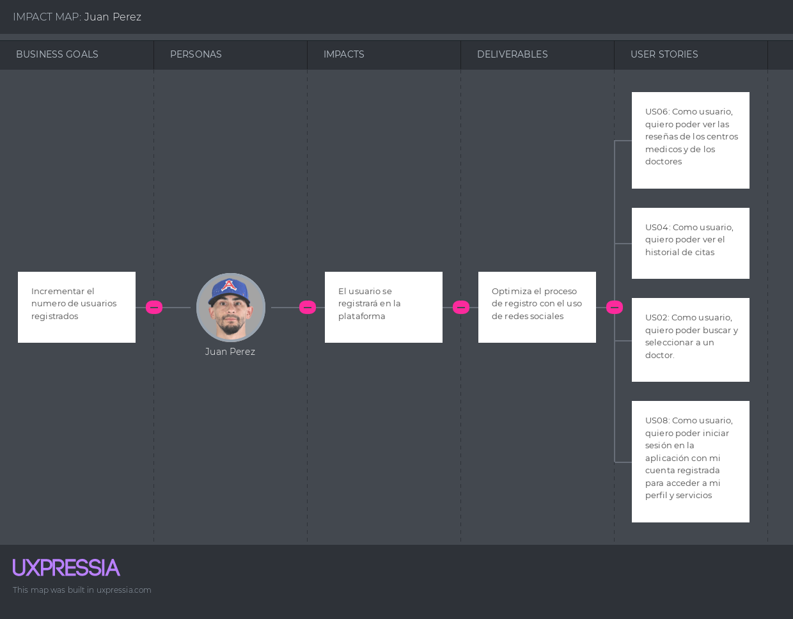
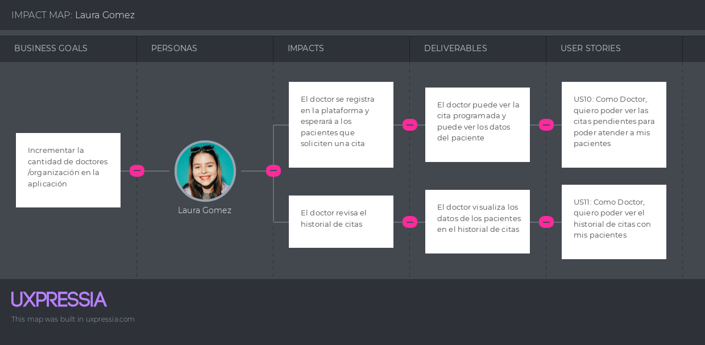

    <strong>Universidad Peruana de Ciencias Aplicadas</strong>

  

# Ingeniería de Software
## Aplicaciones Web  
### Ciclo 2024-02  
#### Sección: WX53  
**Docente**: Alberto Wilmer Sanchez Seña  
**Startup**: HealMe  
**Producto**: HealMe App  
**Grupo de Trabajo**: Grupo 4  
**Nombre del Equipo**: Equipo Dinamita  

### Team Members  
| Nombre                     | Código de alumno   |
|----------------------------|--------------------|
| Alonso Garay, Diego Jesus   | U20221D014         |
| Cisneros Salas, Luis Angel  | U20211B198         |
| Alcántara Cruz, Rodrigo Alonso | U202216698    |

---

### Registro de versiones del informe  

| Fecha       | Versión  | Autor                      | Descripción de modificación                                           |
|-------------|----------|----------------------------|------------------------------------------------------------------------|
| 20/08/2024  | 1.0      |  Rodrigo Alcántara              | Creación de nuestro repositorio e inicio en Capítulo 1                 |
| 27/08/2024  | 1.1      |  Diego Alonso             | Actualización del informe needfinding, user persona, as-is scenario mapping                             |
| 28/08/2024  | 1.2      |  Diego Alonso | Elaboración de User Stories, Product Backlog e Impact Mapping          |
| 30/08/2024  | 1.3      |  Rodrigo Alcántara             | Elaboracion del Landing Page          |
| 01/09/2024  | 1.4      |  Luis Cisneros             | Elaboración de los diagramas C4 y mejora de los User Stories           |
| 05/09/2024  | 1.5      |   Luis Cisneros              | Incorporación del diagrama de clases y modelado del diseño de base de datos |
| 05/09/2024  | 1.6    |Luis Cisneros                 | Landing Page UI Design,Landing Page Wireframe,Landing Page Mock-up,Web Applications UX/UI Design,Web Applications Wireframes,Web Applications Wireflow Diagrams,Web Applications Mock-ups,Web Applications User Flow Diagrams,Web Applications Prototyping|
| 23/09/2024  | 1.7      |   Diego Alonso              | Se agregó las ultimas funcionalidades de la aplicación |
| 24/09/2024  | 1.8      |   Rodrigo Alcántara              | Correccion de la documentacion y elaboracion de la primera version de la aplicacion web |
| 24/09/2024  | 1.9      |   Luis Cisneros              | Elaboracion del log in, register y correcion de diagramas c4 |

---

### Project Report Collaboration Insights  
**URL de la organización en GitHub del proyecto**: https://github.com/HealMe-Team

---

### TB1  
#### Integrante Tareas Asignadas  

| Integrante                        | Tareas Asignadas                                                                 |
|-----------------------------------|----------------------------------------------------------------------------------|
| Diego Alonso, Rodrigo Alcántara, Luis Cisneros          | Elaboración de entrevistas, diagrama de clases y base de datos, colaboración general |
|Diego Alonso | Empathy maps, As-Is y To-Be Scenario Mapping, Ubiquitous Language |
|  Rodrigo Alcántara,          | Startup Profile, Solution Profile, Lean UX, Segmentos Objetivo, Landing Page      |
| Diego Alonso          | User Stories, Product Backlog e Impact Mapping |
|    Luis Cisneros    | Landing Page UI Design,Landing Page Wireframe,Landing Page Mock-up,Web Applications UX/UI Design,Web Applications Wireframes,Web Applications Wireflow Diagrams,Web Applications Mock-ups,Web Applications User Flow Diagrams,Web Applications Prototyping|
|   Luis Cisneros      | Competidores, Analisis competitivo, diseño de entrevistas, Software Architecture Context Diagram, Software Architecture Container Diagram
|  Rodrigo Alcántara   | Diseño de la landing page y desarrollo de la interfaz                             |

## Student Outcome ABET – EAC - Student Outcome 5  
**Criterio**: La capacidad de funcionar efectivamente en un
equipo cuyos miembros juntos proporcionan liderazgo, crean un entorno de
colaboración e inclusivo, establecen objetivos, planifican tareas y cumplen objetivos.

| Criterio específico | Acciones realizadas | Conclusiones |
| -------------------- | ------------------- | ------------ |
| **Trabaja en equipo para proporcionar liderazgo en forma conjunta** | **Alonso Garay, Diego Jesus**: TB1: Para el tb1 complete el capítulo 3, despues elabore los 7 últimos puntos del capitulo V. TP1: Para esta entrega elabore entrevistas con mis compañeros de equipo, implementa las funcionalidades de rutas para la aplicacion web | LLegue a la conclusion que es fundamental trabajar con tiempo para evitar inconvenientes.  |
|**Trabaja en equipo para proporcionar liderazgo en forma conjunta**  | **Cisneros Salas, Luis Angel**: Para la TB1, realice el Landing Page UI Design,Landing Page Wireframe,Landing Page Mock-up,Web Applications UX/UI Design,Web Applications Wireframes,Web Applications Wireflow Diagrams,Web Applications Mock-ups,Web Applications User Flow Diagrams,Web Applications Prototyping, Para el TP1: Implementé las funcionalidades de log in y register para ambos segmentos, tambien corregí los diagramas |  Durante la TB1, enfrentamos algunos desafíos, como la coordinación del equipo, ya que aunque tuvimos buena comunicación, asegurar que todos estuvieran alineados con los plazos y estilos de trabajo fue complicado. Además, las iteraciones constantes de los diseños y prototipos para cumplir con las expectativas también representaron un reto. Otro aspecto desafiante fue encontrar el equilibrio adecuado entre la creatividad del diseño y la funcionalidad de la experiencia de usuario. |
| **Trabaja en equipo para proporcionar liderazgo en forma conjunta** | **Alcántara Cruz, Rodrigo Alonso**: TB1: Para el tb1 complete los ultimos puntos del capitulo 1, despues elabore el landing page basandome en los diseños establecidos por el equipo, acto seguido comence a elaborar los 8 primeros puntos del capitulo V , he creado el repositorio , invite a los compañeros del equipo, elegi la ide que ibamos a utilizar, estableci los lenguajes que se iban a implementar tanto en el landing page como en la app web, y estuve al tanto de actualiozaciones que pueden surgir para implementarlas en el landing page TP1: Para la elaboracion del TP1 he creado la primera version de la aplicacion web, mostrando el inicio del usuario, tambien he corregido la documentacion para esta nueva entrega | LLegue a la conclusion que es fundamental la comunicacion y organizacion con el equipo debido a que podemos crear un ambiente optimo para realizar este proyecto haciendo que podamos completar nuestras partes y subirlas en este repositorio para ver posibles correcciones que podemos realizar para asi presentar un mejor trabajo.

| Criterio específico | Acciones realizadas | Conclusiones |
| -------------------- | ------------------- | ------------ |
| **Crea un entorno colaborativo e inclusivo, establece metas, planifica tareas y cumple objetivos** | **Alonso Garay, Diego Jesus**: TB1: Para el tb1 complete el capítulo 3, despues elabore los 7 últimos puntos del capitulo V.  | LLegue a la conclusion que es fundamental el fomentar un trabajo colaborativo apoyandonos como equipo  |
|**Crea un entorno colaborativo e inclusivo, establece metas, planifica tareas y cumple objetivos**  | **Cisneros Salas, Luis Angel**: Para la TB1, realice el Landing Page UI Design,Landing Page Wireframe,Landing Page Mock-up,Web Applications UX/UI Design,Web Applications Wireframes,Web Applications Wireflow Diagrams,Web Applications Mock-ups,Web Applications User Flow Diagrams,Web Applications Prototyping | He llegado a la conclusion de que el trabajo en equipo no se puede lograr sin establecer los objetivos a cumplir, tener un control de los avances es muy importante |
| **Crea un entorno colaborativo e inclusivo, establece metas, planifica tareas y cumple objetivos** | **Alcántara Cruz, Rodrigo Alonso**: TB1: Para el tb1 complete los ultimos puntos del capitulo 1, despues elabore el landing page basandome en los diseños establecidos por el equipo, acto seguido comence a elaborar los 8 primeros puntos del capitulo V , he creado el repositorio , invite a los compañeros del equipo, elegi la ide que ibamos a utilizar, estableci los lenguajes que se iban a implementar tanto en el landing page como en la app web, y estuve al tanto de actualiozaciones que pueden surgir para implementarlas en el landing page  | LLegue a la conclusion que el trabajo en equipo tiene muchas formas para poder solucionar problemas, debemos fomentar el buen ambiente y esforzarnos para poder hacer un buen trabajo

### TP1  
#### Integrante Tareas Asignadas  

| Integrante                        | Tareas Asignadas                                                                 |
|-----------------------------------|----------------------------------------------------------------------------------|
| Diego Alonso, Rodrigo Alcántara, Luis Cisneros          | Elaboración de entrevistas, colaboración general |
|Diego Alonso | Implementar funcionalidades de la aplicacion web |
|  Rodrigo Alcántara,          | Elaboracion de la primera version de la aplicacion web y correcion de la documentacion     |
| Luis Cisneros          | Elaboracion de los diagramas c4 , log in y register de los 2 segmentos |

    <strong>HealMe</strong>

### Contenido:
#### Capítulo I: Introducción
1.1. Startup Profile  
1.1.1. Descripción de la Startup 
1.1.2. Perfiles de integrantes del equipo  
1.2. Solution Profile  
1.2.1. Antecedentes y problemática  
1.2.2. Lean UX Process  
1.2.2.1. Lean UX Problem Statements  
1.2.2.2. Lean UX Assumptions  
1.2.2.3. Lean UX Hypothesis Statements  
1.2.2.4. Lean UX Canvas  
1.3. Segmentos objetivo  

#### Capítulo II: Requirements Elicitation & Analysis  
2.1. Competidores  
2.1.1. Análisis competitivo  
2.1.2. Estrategias y tácticas frente a competidores  
2.2. Entrevistas  
2.2.1. Diseño de entrevistas  
2.2.2. Registro de entrevistas  
2.2.3. Análisis de entrevistas  
2.3. Needfinding  
2.3.1. User Personas  
2.3.2. User Task Matrix  
2.3.3. User Journey Mapping  
2.3.4. Empathy Mapping  
2.3.5. As-Is Scenario Mapping  
2.4. Ubiquitous Language  

#### Capítulo III: Requirements Specification  
3.1. To-Be Scenario Mapping  
3.2. User Stories  
3.3. Impact Mapping  
3.4. Product Backlog  

#### Capítulo IV: Product Design  
4.1. Style Guidelines  
4.1.1. General Style Guidelines  
4.1.2. Web Style Guidelines  
4.2. Information Architecture  
4.2.1. Organization Systems  
4.2.2. Labeling Systems  
4.2.3. SEO Tags and Meta Tags  
4.2.4. Searching Systems  
4.2.5. Navigation Systems  
4.3. Landing Page UI Design  
4.3.1. Landing Page Wireframe  
4.3.2. Landing Page Mock-up  
4.4. Web Applications UX/UI Design  
4.4.1. Web Applications Wireframes  
4.4.2. Web Applications Wireflow Diagrams  
4.4.3. Web Applications Mock-ups  
4.4.4. Web Applications User Flow Diagrams  
4.5. Web Applications Prototyping  
4.6. Domain-Driven Software Architecture  
4.6.1. Software Architecture Context Diagram  
4.6.2. Software Architecture Container Diagrams  
4.6.3. Software Architecture Components Diagrams  
4.7. Software Object-Oriented Design  
4.7.1. Class Diagrams  
4.7.2. Class Dictionary  
4.8. Database Design  
4.8.1. Database Diagram  

#### Capítulo V: Product Implementation, Validation & Deployment  
5.1. Software Configuration Management  
5.1.1. Software Development Environment Configuration  
5.1.2. Source Code Management  
5.1.3. Source Code Style Guide & Conventions  
5.1.4. Software Deployment Configuration  
5.2. Landing Page, Services & Applications Implementation  
5.2.1. Sprint n  
5.2.1.1. Sprint Planning n  
5.2.1.2. Sprint Backlog n  
5.2.1.3. Development Evidence for Sprint Review  
5.2.1.4. Testing Suite Evidence for Sprint Review  
5.2.1.5. Execution Evidence for Sprint Review  
5.2.1.6. Services Documentation Evidence for Sprint Review  
5.2.1.7. Software Deployment Evidence for Sprint Review  
5.2.1.8. Team Collaboration Insights during Sprint  

## Capítulo I: Introducción
1.1. Startup Profile  
1.1.1. Descripción de la Startup 

Nuestra startup se especializa en ofrecer una solución digital diseñada para turistas y viajeros que requieren acceso inmediato a servicios médicos en una ciudad o país que no conocen por eso hemos decidido crear "HEALME". Nuestra startup permite a los usuarios buscar, comparar y reservar citas médicas en una amplia variedad de especialidades y centros de salud locales. La plataforma facilita el acceso a la atención médica en destinos desconocidos, asegurando que los viajeros puedan recibir el cuidado necesario sin complicaciones.

    <strong>Misión:</strong>

Nuestra misión es proporcionar a los turistas una herramienta confiable y eficiente para acceder a servicios médicos de calidad en cualquier lugar del mundo. Nos comprometemos a simplificar el proceso de búsqueda y reserva de citas médicas, ofreciendo transparencia en precios y ubicación, y garantizando que los viajeros puedan cuidar de su salud sin estrés, sin importar dónde se encuentren.

    <strong>Visión:</strong>

Nos visualizamos como la plataforma líder global en la gestión de citas médicas para viajeros, reconocida por su capacidad para conectar a turistas con centros de salud locales de manera rápida, segura y transparente. Aspiramos a ser la primera opción para cualquier viajero que necesite acceso inmediato a atención médica en una ciudad desconocida, promoviendo una experiencia de viaje más segura y tranquila.
1.1.2. Perfiles de integrantes del equipo  

|Descripción del integrante|Perfil del integrante del equipo|
| :--------| :--------: |
|Mi nombre es **Luis Angel Cisneros Salas** y tengo 20 años. Soy estudiante de la carrera de Ingeniería de Software en la UPC (Universidad Peruana de Ciencias Aplicadas), y actualmente estoy en el quinto ciclo. Gracias a los cursos que he llevado en los últimos ciclos, así como al aprendizaje extracurricular, he adquirido los conocimientos y habilidades necesarios para desarrollarme eficazmente en los proyectos y propuestas de trabajo que ofrecemos. Además, destaco por mi capacidad de empatía, compañerismo y mi rápida adaptación a los cambios, lo cual me permite avanzar de manera colaborativa en los sprints y apoyar a mis compañeros en lo que sea necesario.|
|Mi nombre es **Diego Jesus Alonso Garay** y tengo 21 años. Soy estudiante de la carrera de Ingeniería de Software en la Universidad Peruana de Ciencias Aplicadas (UPC) y actualmente estoy en el quinto ciclo. Me considero una persona intuitiva y busco siempre ver el lado positivo de las cosas, pero siempre con los pies sobre la tierra. Tengo conocimiento en el uso de programas de edición como Photoshop y también sobre el uso básico de lenguajes de programación. Por lo general siempre busco dar lo necesario para realizar un buen trabajo, y en este curso estaré al pendiente de cualquier responsabilidad para realizar correctamente el presente proyecto.|
|Mi nombre es **Rodrigo Alonso Alcantara Cruz** y tengo 19 años. Soy estudiante de la carrera de Ingeniería de Software en la Universidad Peruana de Ciencias Aplicadas (UPC) actualmente estoy en el quinto ciclo. Considero que soy una persona que busca el aprendizaje continuo y siempre intento resolver los problemas de forma rapida y eficaz. Tengo conocimiento en lenguajes de programación. Por lo general siempre intento mejorar mi metodo de estudio para poder expandir mi conocimiento.| 

1.2. Solution Profile  
1.2.1. Antecedentes y problemática  
Para elaborar este punto del proyecto utilizaremos la tecnica de the 5 'W's y 2 'H's-Who, What, Where,When, Why, How & How Much

    <strong>Who (Quiénes):</strong>

Usuarios Objetivos: Turistas, viajeros de negocios y nómadas digitales que necesitan acceso a servicios médicos en destinos desconocidos.

Proveedores de Servicios: Hospitales, clínicas, centros médicos y especialistas locales que ofrecen citas o examenes médicos.

    <strong>What (Qué):</strong>

Qué Ofrecemos: Una plataforma web intuitiva que permite a los usuarios buscar, comparar y reservar citas médicas en una amplia variedad de especialidades y centros de salud locales.

Funcionalidades Clave:

Búsqueda de proveedores médicos por ubicación y especialidad.

Comparación de precios de consultas y exámenes médicos.

Sistema de reservas online en tiempo real.

Reseñas y valoraciones de otros usuarios para guiar las decisiones.

    <strong>Where (Dónde):</strong>

Ubicación de Uso: La plataforma está diseñada para ser utilizada en cualquier parte del mundo, principalmente en destinos turísticos o ciudades con gran afluencia de viajeros.

Proveedores Locales: Hospitales, clínicas y centros médicos ubicados en las principales ciudades y destinos turísticos.

    <strong>When (Cuándo):</strong>

Cuándo Usar la Plataforma:

Antes de viajar, para planificar y reservar citas médicas necesarias.

Durante el viaje, para acceder a servicios médicos de emergencia o de rutina en un entorno desconocido.

Disponibilidad: La plataforma está disponible 24/7, permitiendo a los usuarios hacer reservas en cualquier momento.

    <strong>Why (Por qué):</strong>

Problema que Soluciona: La dificultad de acceder a servicios médicos confiables y transparentes en términos de precios cuando se está en un destino desconocido.

Beneficios:

Reducción del estrés asociado con encontrar atención médica en un lugar desconocido.

Transparencia en los costos, lo que permite a los usuarios tomar decisiones informadas.

Conveniencia y ahorro de tiempo al poder hacer todo desde una única plataforma.

    <strong>How (Cómo):</strong>

Cómo Funciona:
Los usuarios ingresan a la plataforma desde cualquier dispositivo con acceso a internet.

Seleccionan la ubicación, especialidad médica, y comparan opciones disponibles.

Reservan su cita directamente a través de la plataforma, recibiendo confirmación inmediata.

Integración con Proveedores: La plataforma está integrada con los sistemas de los centros médicos locales para reflejar disponibilidad en tiempo real.

    <strong>How Much (Cuánto):</strong>

Modelo de Negocio:

Para Usuarios: La plataforma puede ofrecer servicios básicos gratuitos con la opción de planes premium que incluyan características adicionales como asistencia personalizada, traducción de idiomas o seguros de cancelación de citas.

Para Proveedores: Los centros médicos podrían pagar una tarifa por aparecer en la plataforma o una comisión por cada cita reservada a través de la misma.

Costos para el Usuario: Transparencia total en los costos de las consultas y exámenes médicos antes de la reserva, con la posibilidad de comparar entre diferentes proveedores.

### 1.2.2 Lean UX Process. 
#### 1.2.2.1. Lean UX Problem Statements.

Problem 1: los pacientes enfrentan largos tiempos de espera y procedimientos complicados al programar citas

Problem 2: El acceso a diferentes proveedores de atención médica obliga a los pacientes a visitar varios sitios web o realizar varias llamadas para agendar una cita.

Problem 3: Los precios de los test clínicos resultan en costos inesperados para los pacientes que no pueden comparar los precios de diferentes médicos.

#### 1.2.2.2. Lean UX Assumptions.

Assumption 1: los pacientes necesitan una plataforma centralizada que les permite reservar citas con varios profesionales de la salud sin tener que navegar por varios sitios web.

Assumption 2: La fijación de precios transparente para el tratamiento aumenta la satisfacción del paciente y la confianza en la plataforma.

Assumption 3: Cada vez un número mayor de pacientes, especialmente viajeros o turistas, utilizan servicios que facilitan el acceso rápido a citas médicas en lugares desconocidos.

#### 1.2.2.3. Lean UX Hypothesis Statements. 

Hypothesis 1: Si creamos una aplicación web que logre centralizar la reserva de citas médicas, los pacientes podrán encontrar más fácil y rápido el agendar citas.

Hypothesis 2:Si proporcionamos precios transparentes para los servicios médicos en nuestra plataforma, los pacientes se sentirán más seguros en sus elecciones de salud y serán más propensos a reservar a través de nuestra aplicación.

Hypothesis 3:Si ofrecemos la opción de reservar citas basadas en la ubicación con precios transparentes, los viajeros y turistas serán más propensos a utilizar nuestra plataforma cuando busquen servicios médicos en ciudades desconocidas.

#### 1.2.2.4. Lean UX Canvas. 

link [Figma](https://www.figma.com/design/s37bCHKy5eBk1Sln8afpiZ/Lean-UX-Canvas-2.0-(Community)?node-id=0-1&t=9bCVqEUJRZ9nI6oy-1)

## Business problem
¿Qué problema de negocio hemos identificado que necesita ayuda?

La dificultad para agendar citas médicas de manera rápida y eficiente, la complejidad en el acceso a múltiples proveedores de salud y la falta de transparencia en los precios de los servicios médicos, estas experiencias suelen ser muy insatisfactorias para los pacientes.

## Solution ideas

Una plataforma web centralizada que permita a los pacientes el poder agendar citas con múltiples centros de salud desde un solo lugar.

Funcionalidad de búsqueda por ubicación para encontrar centros de salud cercanos a su ubicación.

Transparencia en los precios de los servicios médicos, permitiendo a los usuarios comprar costos.

Integración de recordatorios automáticos y seguimiento de citas para mejorar la experiencia del paciente 

## Business outcomes

Aumento en la cantidad de citas medicas agendadas a traves de la plataforma

Mayor tasa de retención de usuarios que regresan a la plataforma para reservar futuras citas 

Mejora en la satisfacción del cliente reflejada en calificaciones positivas y reseñas

Incremento en el uso de la plataforma por parte de viajeros y turistas para reservar citas médicas en ubicaciones desconocidas.

## Users and costumers:

Pacientes locales que buscan facilidad y rapidez al agendar citas médicas.

Viajeros y turistas que necesitan acceso rápido a servicios médicos en ciudades desconocidas.

Centros médicos y clínicas que desean aumentar su visibilidad y accesibilidad para atraer más pacientes.

## User Benefits

Agendar citas médicas de manera rápida y sin complicaciones.

Acceder a una variedad de opciones de proveedores de salud en un solo lugar.

Obtener información clara y transparente sobre los costos de los servicios médicos para tomar decisiones informadas.

Facilitar el acceso a servicios médicos mientras están en una ubicación desconocida.

## Hypotheses

Creemos que un aumento en la cantidad de citas agendadas se logrará si los pacientes locales obtienen facilidad y rapidez en la reserva de citas con una plataforma centralizada.

Creemos que una mayor satisfacción del cliente se logrará si los pacientes obtienen transparencia en los costos de los servicios médicos con la funcionalidad de comparación de precios.

Creemos que un aumento en el uso de la plataforma por parte de viajeros se logrará si los viajeros y turistas obtienen acceso rápido a servicios médicos con la funcionalidad de búsqueda por ubicación.

## Whats the most important thing we need to learn first?

Que los pacientes realmente prefieren una plataforma centralizada sobre los métodos tradicionales de reserva de citas.

Que la transparencia en los precios es un factor decisivo para que los pacientes elijan un proveedor de salud.

Que los viajeros y turistas usarán una plataforma web para agendar citas médicas en lugar de buscar asistencia médica localmente.

## Whats the leas amount of work we need to do learn the next most importan thing?

Lanzar una versión beta de la plataforma con una selección limitada de proveedores de salud y medir cuántos usuarios completan el proceso de reserva de citas.

Implementar una prueba A/B que compare la reserva de citas con y sin transparencia de precios para evaluar el impacto en la decisión del paciente.

Crear una campaña de marketing dirigida a viajeros y turistas para evaluar el interés y la utilización de la funcionalidad de búsqueda por ubicación.

1.3. Segmentos objetivo. 

Viajeros/Turistas: Personas que se encuentran en una ciudad o país diferente y necesitan acceso rápido a servicios médicos sin conocimiento previo del área. Las características clave para este segmento incluyen la búsqueda basada en la ubicación y la transparencia en los precios para ayudarles a tomar decisiones informadas rápidamente.

Centros medicos /doctores : Centros medicos y profesionales de salud los cuales busquen obtener mas pacientes para atender, pues a la hora que turistas busquen centros medicos no logren encontrar uno optimo para ellos haciendo que varios centros medicos y doctores no puedan encontrar pacientes

## Capítulo II: Requirements Elicitation & Analysis  

##    2.1. Competidores

En el contexto de un mercado peruano en constante cambio y evolución, la gestión eficiente de los procesos en HealMe es una necesidad primordial en el sector sanitario. HealMe enfrenta el desafío urgente de comprender y abordar a sus competidores para asegurar una posición sólida y garantizar la satisfacción de sus usuarios.

**1. Thaniy**
Thaniy es una asociación sin fines de lucro fundada por profesionales de la salud peruanos para mejorar el acceso a servicios médicos en Perú. A través de un sistema informático, Thaniy conecta a los peruanos con atención médica sin costos adicionales. 

**2. HelpMed**
HelpMed es una empresa con años de experiencia en el mercado y con enfoque a responder rápidamente a emergencias médicas prehospitalarias. Su equipo está compuesto por médicos generales y especialistas, licenciados y paramédicos.

**3. Sanna**
Sanna es una de las redes privadas de salud más grandes de Perú, con una amplia capacidad de atención a nivel nacional. Su infraestructura abarca clínicas, centros clínicos y una variedad de servicios de asistencia médica, como ambulancias, nutricionistas, entre otros. Entre algunos de los servicios que ofrecen se encuentran la opción de solicitar un medico a domicilio y realizar una teleconsulta médica.

**4. Sanitas**
Es un servicio de salud privado brindado EPS que complementa la cobertura de EsSalud. Entre uno de los servicios que ofrece se encuentra la teleconsulta y una cobertura de salud internacional.

###    2.1.1. Análisis competitivo. 

<table>
    <thead>
        <tr>
            <th colspan="7">Competitive Analysis Landscape</th>
        </tr>
        <tr>
            <td colspan="3"><b>¿Por qué llevar a cabo este análisis?</b></td>
            <td colspan="4">Este análisis nos permitirá reconocer a las compañias competidoras y sus respectivos servicios similares a HealMe y resaltar las funcionalidades y carencias que estas mismas posean para comparar con nuestra propuesta. </td>
        </tr>
        <tr class="nombres-competidores">
        <td style="font-weight: bold; text-align:center;" colspan="2">Punto de análisis</td>
        <td style="font-weight: bold;">HealMe</td>
        <td style="font-weight: bold;">Thaniy</td>
        <td style="font-weight: bold;">HelpMed</td>
        <td style="font-weight: bold;">Sanna</td>
        <td style="font-weight: bold;">Sanitas</td>
        </tr>
        <tr class="logos-competidores">
        <td style="font-weight: bold; text-align:center;" colspan="2">Logo</td>
        <td>Logo de HealMe</td>
        <td></td>
        <td></td>
        <td></td>
        <td></td>
        </tr>
    </thead>
    <tbody>
    <tr>
        <td rowspan="2" style="font-weight: bold;">Perfil</td>
        <td style="font-weight: bold;">Overview</td>
        <td>HealMe es una plataforma digital diseñada para turistas y viajeros que necesitan acceso rápido a servicios médicos en destinos desconocidos. La aplicación permite a los usuarios buscar, comparar y reservar citas médicas en una amplia variedad de especialidades y centros de salud locales. Su misión es facilitar la atención médica al ofrecer transparencia en precios y ubicación. HealMe se posiciona como la solución global para la gestión de citas médicas durante los viajes, integrando funcionalidades como reseñas de usuarios, precios de consultas y recomendaciones para destinos con condiciones especiales.</td>
        <td>Thaniy es una asociación sin fines de lucro creada por profesionales de la salud peruanos para mejorar el acceso a servicios médicos en Perú. Utiliza un sistema informático para conectar a los peruanos con atención médica de manera gratuita, sin costos adicionales. Thaniy se enfoca en ofrecer una plataforma accesible y eficiente para facilitar el acceso a la salud en todo el país</td>
        <td>HelpMed es una empresa con años de experiencia en el mercado y con enfoque a responder rápidamente a emergencias médicas prehospitalarias. Su equipo está compuesto por médicos generales y especialistas, licenciados y paramédicos.</td>
        <td>Sanna es una de las redes privadas de salud más grandes de Perú, con una amplia capacidad de atención a nivel nacional. Su infraestructura abarca clínicas, centros clínicos y una variedad de servicios de asistencia médica, como ambulancias, nutricionistas, entre otros. Entre algunos de los servicios que ofrecen se encuentran la opción de solicitar un medico a domicilio y realizar una teleconsulta médica.</td>
        <td>Es un servicio de salud privado brindado EPS que complementa la cobertura de EsSalud. Entre uno de los servicios que ofrece se encuentra la teleconsulta y una cobertura de salud internacional.</td>
    </tr>
    <tr>
        <td style="font-weight: bold;">Ventaja competitiva ¿Que valor ofrece a los clientes?</td>
        <td>HealMe conecta a turistas con centros de salud cercanos, ofreciendo una plataforma fácil de usar para visualizar ubicación, costos y reseñas. Además, proporciona consejos personalizados basados en condiciones climáticas y tiene un enfoque transaccional eficiente con comisiones, beneficiando tanto a usuarios como a centros de salud.</td>
        <td>Thaniy ofrece atención médica a domicilio sin costos adicionales, gracias a su red de médicos y cirujanos voluntarios. Su enfoque sin fines de lucro permite brindar un servicio accesible para aquellos que no pueden cubrir gastos médicos, aunque no está asociado con centros de salud específicos.</td>
        <td>HelpMed destaca por su rápida respuesta en emergencias médicas prehospitalarias, con una flota de vehículos y equipos especializados para atención urgente, incluyendo servicios médicos y pediátricos a domicilio. Sin embargo, su presencia aún es limitada en algunas áreas del país.</td>
        <td>Sanna cuenta con una extensa red de centros de salud y ofrece servicios como teleconsultas y atención a domicilio. No obstante, puede ser menos ágil en la programación de consultas. Su capacidad de ofrecer atención médica variada es un punto fuerte, aunque la experiencia puede ser lenta.</td>
        <td>Sanitas ofrece una cobertura extensa en clínicas y hospitales, además de incluir servicios de teleconsulta y seguro para medicamentos según el plan. Su asociación con varias clínicas permite una cobertura más amplia y accesible. Sin embargo, su alto costo y posibles dificultades para hacer valer el seguro es uno de sus puntos debiles.</td>
    </tr>
    <tr>
        <td rowspan="2" style="font-weight: bold;">Plan de Marketing</td>
        <td style="font-weight: bold;">Mercado Objetivo</td>
        <td><ul>
            <li>Turistas y viajeros peruanos que requieran atención médica en areas desconocidas</li>
            <li>Extranjeros en Perú que no estan familiarizados con el sistema de salud local</li>
            </ul></td>
        <td><ul>
            <li>Pacientes que requieran atención a domicilio</li>
            <li>Profesionales ocupados</li>
            <li>Pacientes que necesiten una consulta rapida en linea</li>
            </ul></td>
        <td><ul>
            <li>Personas en situaciones de emergencia médica</li>
            <li>Usuarios que Necesitan Servicios Médicos a Domicilio</li>
            </ul></td>
        <td><ul>
            <li>Pacientes que Buscan Atención Médica Variada</li>
            <li>Usuarios de Teleconsultas</li>
            </ul></td>
        <td><ul>
            <li>Usuarios de EPS</li>
            <li>Personas que Necesitan Seguro para Medicamentos o cobertura internacional</li>
            </ul></td>
    </tr>
    <tr>
        <td style="font-weight: bold;">Estrategias de Marketing</td>
        <td><ul>
            <li>Tiktok Ads</li>
            <li>Facebook Ads</li>
            <li>Marketing de contenidos</li>
            <li>Email Marketing</li>
            <li>SEM (Search Engine Marketing)</li>
            <li>Colaboraciones con Influencers y Bloggers de Viajes</li>
            <li>Publicidad en Plataformas de Turismo y Viajes</li>
            </ul></td>
        <td><ul>
            <li>Marketing de redes sociales</li>
            <li>Marketing de contenidos</li>
            <li>Email Marketing</li>
            </ul></td>
        <td><ul>
            <li>Email Marketing</li>
            <li>Marketing de contenidos</li>
            <li>Social Ads</li>
            <li>Publicidad en medios locales</li>
            </ul></td>
        <td><ul>
            <li>Social Ads</li>
            <li>SEO</li>
            <li>Email Marketing</li>
            <li>Marketing de contenidos</li>
            </ul></td>
        <td><ul>
            <li>Social Ads</li>
            <li>SEO</li>
            <li>Email Marketing</li>
            <li>Marketing de contenidos</li>
            <li>Colaboración con influencers</li>
            <li>Publicidad en medios de comunicacion</li>
            </ul></td>
    </tr>
    <tr>
        <td rowspan="3" style="font-weight: bold;">Perfil de producto</td>
        <td style="font-weight: bold;">Productos & Servicios</td>
        <td><ul>
            <li>Consulta Médica en Centros de Salud Cercanos
</li>
            <li>Exámenes Médicos en Centros de Salud Cercanos
</li>
            <li>Reservas de Citas Médicas en Línea
</li>
<li>Información sobre Ubicación y Costos de Servicios Médicos
</li>   
            <li>Reseñas y Valoraciones de Centros de Salud
</li>
            <li>Consejos Médicos Personalizados Basados en Condiciones Climáticas
</li>
            </ul></td>
        <td><ul>
            <li>Atención médica a domicilio</li>
            <li>Consulta Médica General y Especializada a Domicilio</li>
            <li>Servicios de Emergencia Médica a Domicilio
            <li>Orientación y Apoyo Médico General</li>
            </ul></td>
        <td><ul>
            <li>Atención Médica de Emergencia Prehospitalaria
</li>
            <li>Servicio de Ambulancias para Emergencias y Eventos
</li>
            <li>Consulta Médica a Domicilio
</li>
            <li>Consulta Pediátrica a Domicilio
</li>
            <li>Servicios de Primeros Auxilios
</li>
            </ul></td>
        <td><ul>
            <li>Consultas Médicas en Clínicas y Centros Clínicos
</li>
            <li>Servicios de Atención a Domicilio
</li>
            <li>Teleconsultas Médicas
</li>
            <li>Atención de Urgencias y Emergencias
</li>
            <li>Servicios de Ambulancias
</li>
            <li>Consultas con Especialistas y Nutricionistas
</li>
            </ul></td>
        <td><ul>
            <li>Cobertura Médica en Clínicas Privadas y Asociadas
</li>
            <li>Teleconsultas Médicas
</li>
            <li>Seguros para Medicamentos
</li>
            <li>Servicios de Atención Médica en Clínicas
</li>
            <li>Cobertura Internacional de Salud
</li>
            </ul></td>
    </tr>
    <tr>
        <td style="font-weight: bold;">Precios & Costos</td>
        <td>HealMe funcionará con un modelo transaccional, cobrando al centro de salud un 5% del costo total del servicio por cada cliente que se conecte a través de la plataforma.</td>
        <td>
Thaniy ofrece atención médica en línea a partir de S/ 20, con precios que incrementan según la complejidad del servicio. Además, también disponen de atención médica a domicilio, con tarifas que comienzan en S/ 50. </td>
        <td>HelpMed ofrecen medicos a domicilio desde los S/140, ademas de ofrecer ambulancias a domicilio desde los S/700.</td>
        <td>Sanna ofrece consultas médicas a partir de S/79, además de una variedad de planes de salud que van desde S/95 hasta S/329 al mes.</td>
        <td>Sanitas ofrece seguros médicos privados con precios que van desde S/90 hasta S/410 mensuales.
</td>
    </tr>
    <tr>
        <td style="font-weight: bold;">Canales de distribución (Web y/o Móvil)</td>
        <td>
HealMe contará con una aplicación web en donde el usuario podrá disfrutar de todas sus funcionalidades.</td>
        <td>
Thaniy cuenta con un formulario de contacto en su sitio web para redirigir a sus clientes a su canal de WhatsApp.</td>
        <td>
HelpMed cuenta con un formulario de contacto , numeros de contacto y direcciones de referencia, además de un canal de WhatsApp para atender a todas sus consultas.</td>
        <td>
Sanna de igual manera tiene un formulario de contacto y canales de contacto en su sitio web.</td>
        <td>
Sanitas cuenta con un sitio web que ofrece múltiples canales de contacto, los cuales redirigen a los clientes potenciales hacia medios de comunicación tradicionales para continuar con el proceso de adquisición.</td>
    </tr>
    <tr>
        <td rowspan="4" style="font-weight: bold;">Análisis SWOT</td>
        <td style="font-weight: bold;">Fortalezas</td>
        <td><ul>
            <li>Plataforma que combina salud y turismo, un nicho de mercado poco explotado.
</li>
            <li>Los usuarios pueden visualizar la ubicación, costos, reseñas y reservar citas con anticipación, todo en una misma plataforma</li>
            <li>Amplia accesibilidad con la capacidad de reservar citas y realizar pagos en línea.
</li>
            <li>Provisión de información sobre condiciones climáticas y consejos médicos para turistas.
</li>
            <li>Genera ingresos recurrentes a través de comisiones cobradas a los centros de salud, manteniendo la plataforma accesible para los usuarios.
</li>
            <li>HealMe está diseñada para atender las necesidades específicas de turistas y ciudadanos en Perú, con un conocimiento profundo del mercado local.</li>
            </ul></td>
        <td>
            <ul>
                <li>Cuenta con una red de médicos y especialistas</li>
                <li>Ofrece atención médica a precios muy accesibles</li>
                <li>Especialización en servicios médicos a domicilio</li>
            </ul>
        </td>
        <td><ul>
            <li>Alta capacidad de respuesta en situaciones de emergencia, con una flota de vehículos equipada para primeros auxilios</li>
            <li>Ofrece una gama de servicios que incluye médico a domicilio, pediatra a domicilio, y cobertura para eventos.</li>
            <li>Varios años de experiencia en el mercado</li>
            <li>Equipos médicos y paramédicos entrenados para manejar emergencias prehospitalarias.</li>
            </ul></td>
        <td><ul>
            <li> Cuenta con una extensa red de clínicas y centros médicos en todo el país</li>
            <li> Ofrece desde atención en clínicas hasta teleconsultas y servicios de nutricionistas.</li>
            <li>Puede manejar grandes volúmenes de pacientes debido a su infraestructura y personal médico especializado.</li>
            </ul></td>
        <td><ul>
            <li>Ofrece seguros con cobertura médica internacional, lo que es atractivo para clientes que viajan con frecuencia.</li>
            <li>Amplia red de clínicas privadas asociadas, lo que permite una mayor cobertura de atención.</li>
            <li>Diversos planes de seguros que pueden adaptarse a las necesidades específicas de los usuarios</li>
            </ul></td>
    </tr>
    <tr>
        <td style="font-weight: bold;">Debilidades</td>
        <td><ul>
            <li>Dependencia de la conectividad.
</li>
            <li>Necesidad de establecer relaciones sólidas con centros de salud para garantizar la calidad del servicio.
</li>
            <li>Costos de Adquisición de Usuarios</li>
</li>
            </ul></td>
        <td><ul>
            <li>Limitada Cobertura Geográfica</li>
            <li>No está asociado a centros de salud, lo que limita la variedad de servicios que puede ofrecer.</li>
            <li>Puede tener limitaciones en cuanto a la cantidad de pacientes que pueden atender simultáneamente.</li>
            </ul></td>
        <td><ul>
            <li>Posicionamiento Geográfico Limitado</li>
            <li>Falta de Diversificación en Servicios</li>
            <li>Dependencia de Vehículos y Equipos</li>
            <li>Precios altos para el mercado</li>
            </ul></td>
        <td><ul>
            <li>Lentitud en el Proceso de Consulta</li>
            <li>Servicios en Línea Limitados</li>
            <li>Altos Costos Operativos</li>
            <li>Dependencia de la Infraestructura Física</li>
            </ul></td>
        <td><ul>
            <li>Altos Costos para el Usuario</li>
            <li>Trabas en la Utilización del Seguro</li>
            <li>Dependencia de Clínicas Asociadas</li>
            </ul></td>
    </tr>
    <tr>
        <td style="font-weight: bold;">Oportunidades</td>
        <td><ul>
            <li>Expansión a otros países de América Latina con alta afluencia de turismo.
                <li>Crecimiento en la demanda de servicios médicos a domicilio y telemedicina.
</li>
            <li>Posible colaboración con agencias de viajes y aerolíneas para atraer más usuarios.
</li>
            </ul></td>
        <td><ul>
            <li>Expansión Regional: Ampliar su cobertura a más áreas del país y colaborar con otras organizaciones para aumentar su impacto.</li>
            <li>Formar alianzas con entidades gubernamentales y empresas para obtener más fondos y recursos.</li>
            <li> Integrar herramientas tecnológicas para optimizar la coordinación y la gestión de pacientes.</li>
            </ul></td>
        <td><ul>
            <li>Aumentar su presencia en todo el país para ofrecer servicios de emergencia en más localidades.</li>
            <li> Establecer acuerdos con organizadores de eventos y empresas para ofrecer servicios de emergencia en grandes reuniones y actividades.</li>
            <li>Ampliar su oferta para incluir servicios médicos regulares y programas de salud preventiva.</li>
            </ul></td>
        <td><ul>
            <li>Mejorar y expandir sus servicios en línea, como la telemedicina y la gestión de citas, para atraer a un público más amplio.</li>
            <li>Ampliar su red de clínicas y centros médicos para cubrir más regiones y ofrecer servicios en áreas no atendidas.</li>
            <li>Establecer acuerdos con compañías de seguros para ofrecer paquetes combinados y atraer a más clientes.</li>
            </ul></td>
        <td><ul>
            <li>Ampliar su cobertura a nivel internacional para atraer a clientes que viajan o residen fuera del país.</li>
            <li>Crear nuevos planes de seguros con opciones más flexibles y accesibles para diferentes segmentos de mercado.</li>
            <li>Colaborar con empresas tecnológicas para integrar soluciones avanzadas en sus servicios y mejorar la experiencia del usuario.</li>
            </ul></td>
    </tr>
    <tr>
        <td style="font-weight: bold;">Amenazas</td>
        <td><ul>
            <li>Competencia directa de otras plataformas de salud con modelos similares.
</li>
            <li>Factores económicos o políticos que afecten el turismo y, por ende, la demanda de servicios médicos.</li>
            <li>Posible resistencia de algunos centros de salud a adoptar nuevas tecnologías.
</li>
            </ul></td>
        <td><ul>
            <li>Competencia con Servicios de Salud Establecidos</li>
            <li>Poca Presencia en el Mercado</li>
            <li>Ausencia de Infraestructura Médica</li>
            <li>Falta de Médicos Especializados</li>
            </ul></td>
        <td><ul>
            <li>Altos Costos Operativos</li>
            <li>Desafíos en la Expansión Geográfica</li>
            </ul></td>
        <td><ul>
            <li>Desafíos en la Atención Eficiente</li>
            <li>Costos Operativos Altos</li>
            <li>Competencia con Servicios Digitales</li>
            </ul></td>
        <td><ul>
            <li>Altos Costos para los Usuarios</li>
            <li>Trabas en el Uso de Seguros</li>
            <li>Competencia con Servicios Públicos de Salud:</li>
            <li>Cambios en Políticas de Seguros</li>
            </ul></td>
    </tr>
    </tbody>
</table>

###    2.1.2. Estrategias y tácticas frente a competidores. 
<cite>Según Michael Porter, la estrategia competitiva implica cómo una empresa compite en su mer- cado específico. Porter identificó tres estrategias generales que las empresas pueden emplear para competir con éxito: liderazgo en costos, diferenciación y enfoque. La estrategia de liderazgo en costos implica ofrecer productos o servicios a precios más bajos que los de los competidores, mientras que la diferenciación se basa en ofrecer productos y servicios únicos y distintivos. Por otro lado, una estrategia de enfoque se centra en un segmento de mercado específico. Para llevar a cabo eficazmente estas estrategias, las empresas necesitan tener un profundo conoci- miento de sus mercados y competidores para desarrollar y mantener una ventaja competitiva sostenible a largo plazo.</cite>

Teniendo en cuenta el análisis SWOT previamente presentado para HealMe, proponemos las siguientes estrategias competitivas:

**Estrategias competitivas para HealMe**

**1. Estrategia de Liderazgo en Costos**
Estrategia: Optimizar los costos operativos de HealMe para ofrecer un servicio de alta calidad a precios competitivos y sin costos iniciales para los usuarios. Tácticas:

Tecnología Eficiente: Implementar tecnologías de vanguardia para mejorar la eficiencia operativa y reducir costos asociados a la infraestructura.

Negociaciones Favorables: Establecer acuerdos ventajosos con centros de salud para minimizar costos iniciales y gastos operativos.

Modelo de Cero Costo Inicial: Ofrecer acceso gratuito a la plataforma para los usuarios, atrayendo así a una base de clientes más amplia.

**2. Diferenciación a través de la Innovación**
Estrategia: Desarrollar y promover características únicas de HealMe que resalten la plataforma como la opción más innovadora para la búsqueda de atención médica.

Tácticas:

Funcionalidades Exclusivas: Incorporar características innovadoras como la integración de información sobre condiciones climáticas y recomendaciones médicas personalizadas.
Inversión en I+D: Continuar invirtiendo en investigación y desarrollo para mejorar la plataforma y ofrecer nuevas funcionalidades.
Promoción Activa: Utilizar campañas de marketing para destacar las características avanzadas y los beneficios únicos de HealMe.

**3. Enfoque en Segmentos Específicos del Mercado**
Estrategia: Especializarse en atender a turistas y viajeros en Perú, ofreciendo soluciones adaptadas a sus necesidades particulares. 

Tácticas:

Identificación de Segmentos Clave: Focalizarse en turistas y viajeros que requieren atención médica durante su estancia en Perú.
Desarrollo de Paquetes Especializados: Crear paquetes y servicios personalizados para este segmento, como información sobre atención médica en destinos específicos.
Colaboraciones Locales: Establecer alianzas con operadores turísticos y agencias de viaje para promocionar HealMe entre sus clientes.

**4.Estrategia de Alianzas Estratégicas**
Estrategia: Formar alianzas estratégicas con centros de salud y organizaciones locales para expandir la red de servicios y aumentar el alcance de HealMe.

Tácticas:

Asociaciones con Centros de Salud: Colaborar con una amplia gama de centros de salud, asegurando cobertura en diversas áreas y aumentando la oferta de servicios.
Colaboraciones con Organizaciones de Turismo: Asociarse con empresas de turismo y agencias de viajes para integrarse en sus servicios y ofrecer HealMe como una solución recomendada.
Programas de Referencias: Implementar programas de referencia con centros de salud y otras entidades para atraer nuevos usuarios y centros asociados.

**5. Estrategia de Marketing Diferenciado**
Estrategia: Desarrollar campañas de marketing que resalten las ventajas únicas de HealMe y sus beneficios para los usuarios. 

Tácticas:

Contenido Educativo: Crear y distribuir contenido educativo que informe a los usuarios sobre cómo HealMe puede resolver sus necesidades específicas de atención médica durante sus viajes.
Testimonios y Casos de Éxito: Utilizar testimonios de usuarios satisfechos y casos de éxito para demostrar la efectividad y valor de HealMe.
Campañas en Redes Sociales: Aprovechar las redes sociales para llegar a un público más amplio y promover las características únicas de la plataforma.

### 2.2.1. Diseño de entrevistas. 

Entrevista a personas referentes a nuestro segmentos objetivo, las preguntas varían dependiendo del segmento debido a las diferentes situaciones:

**Segmento 1:** Viajeros / Turistas

**Preguntas de Introducción:**
1. ¿Cuál es su nombre y a que se dedica?
2. ¿Qué destinos ha visitado recientemente y cuáles suele visitar con más frecuencia?
3. ¿Cuál es el propósito principal de sus viajes (por ejemplo, turismo, negocios, visitar familiares, estudios, etc.)?
4. ¿Suele viajar solo, en pareja, con familia o en grupo?
5. ¿Con qué frecuencia viaja fuera de su ciudad o país?

**Preguntas Principales:**

**1 - ¿Ha tenido alguna vez la necesidad de buscar atención médica mientras estaba de viaje? Si es así, ¿cómo fue su experiencia?**
Objetivo: Comprender las experiencias previas de los viajeros con la atención médica durante sus viajes, incluyendo desafíos y expectativas.

**2 - Cuando necesita atención médica en una ciudad o región que no conoce, ¿qué aspectos son los más importantes para usted al elegir un centro de salud o médico (ubicación, costos, calidad, etc.)?**
Objetivo: Identificar los criterios clave que los turistas y viajeros consideran al seleccionar servicios médicos en un área desconocida.

**3 - ¿Le resultaría útil una aplicación que le ofrezca múltiples opciones de centros de salud y médicos, con la posibilidad de comparar precios y servicios antes de tomar una decisión?**
Objetivo: Evaluar el interés en la funcionalidad principal de HealMe para comparar opciones de atención médica.

**4 - ¿Qué tan importante es para usted contar con información en su idioma sobre los servicios médicos disponibles?**
Objetivo: Determinar la importancia de la accesibilidad lingüística en la oferta de servicios médicos para turistas.

**5 - ¿Ha tenido dificultades para encontrar información confiable sobre centros de salud en áreas donde ha viajado? En caso afirmativo, ¿cuáles fueron los principales obstáculos?**
Objetivo: Identificar los desafíos comunes que enfrentan los turistas al buscar atención médica en áreas desconocidas.

**6 - ¿Qué tan importante considera la posibilidad de acceder a reseñas y valoraciones de otros pacientes al momento de elegir un servicio médico en una ciudad o provincia que no conoce?**
Objetivo: Evaluar la importancia de las reseñas y valoraciones en la toma de decisiones de los viajeros.

**7 - ¿Le gustaría que HealMe le proporcionara información sobre la calidad sanitaria del lugar al que viaja, basada en la experiencia de otros usuarios que ya han visitado la región?**
Objetivo: Evaluar el interés en recibir evaluaciones de calidad sanitaria de destinos turísticos, basadas en la retroalimentación de otros viajeros.

**8 - ¿Qué tan útil le resultaría tener acceso a una sección en HealMe con información sobre los costos aproximados de medicamentos esenciales en la región que va a visitar?**
Objetivo: Determinar la necesidad y el valor de contar con información anticipada sobre el costo de medicamentos comunes en destinos turísticos.

**9 - Si viajara a destinos exóticos en la selva o a áreas con alta concentración de mosquitos, ¿consideraría útil que HealMe le recomendara cremas o sprays repelentes específicos, incluyendo información sobre su costo y disponibilidad?**
Objetivo: Explorar el interés en recibir recomendaciones de productos para la salud y su costo, adaptadas a las condiciones particulares de destinos con riesgos específicos como la selva.

**10 - Al planificar un viaje a destinos de gran altitud, ¿le parecería conveniente que HealMe le sugiriera productos para prevenir el mal de altura, junto con información sobre su costo y dónde adquirirlos?**
Objetivo: Evaluar la utilidad de recomendaciones personalizadas de productos de salud para prevenir problemas comunes en destinos de gran altitud.

**11 - ¿Qué sugerencias tendría para mejorar una aplicación diseñada para facilitar el acceso a servicios médicos en una región desconocida para turistas como usted?**
Objetivo: Recopilar recomendaciones para optimizar la usabilidad y efectividad de HealMe 

 **12 -  ¿Cuánto estaría dispuesto/a a pagar por una aplicación que le permita gestionar y agendar citas médicas o exámenes de manera rápida y sencilla durante su viaje?**
Objetivo: Explorar la disposición a pagar por los servicios de HealMe y el valor percibido por los viajeros.

**13 - ¿Qué recomendaciones o sugerencias tendría para el equipo de HealMe en términos de diseño, implementación o uso de la plataforma para maximizar su efectividad en la mejora de la experiencia del turista?**
     - Objetivo: Recopilar ideas y sugerencias prácticas para optimizar la funcionalidad y usabilidad de la plataforma HealMe.

**Segmento 2:** Doctores o centros de salud

**Preguntas de Introducción:**
1. ¿Cuál es su nombre y el nombre del centro de salud que trabaja?
2. ¿Cuántos años lleva en el sector de la salud?
3. ¿En qué ciudad o región del Perú se encuentra su centro de salud?
4. ¿Cuál es el tamaño de su centro de salud en términos de capacidad y número de empleados?
5. ¿Qué tipo de servicios médicos son los más demandados en su centro de salud?

**Preguntas Principales:**

**1.¿Cuáles son los principales desafíos que enfrenta su centro de salud al atraer y retener pacientes, especialmente aquellos que son turistas o viajeros?**
Objetivo: Identificar las dificultades actuales para captar pacientes externos, especialmente turistas, y explorar cómo HealMe podría ayudar a superar estos desafíos.
**2. ¿Cómo considera que la visibilidad en una plataforma como HealMe, que conecta a turistas con centros de salud, podría beneficiar a su negocio?**
Objetivo: Explorar las percepciones sobre el valor agregado que HealMe podría ofrecer a su centro de salud, en términos de atraer nuevos pacientes.

**3.¿Qué tan importante considera la posibilidad de ofrecer precios competitivos y transparentes en HealMe para atraer a pacientes, especialmente aquellos que buscan opciones médicas mientras están de viaje?**
Objetivo: Evaluar la relevancia de la transparencia en precios como un factor clave para atraer pacientes a través de la plataforma.

**4.¿En qué aspectos cree que HealMe podría mejorar o qué funcionalidades adicionales serían importantes para que considere unirse a la plataforma?**
Objetivo: Recopilar sugerencias para el desarrollo y mejora de la plataforma, basadas en las necesidades y expectativas de los centros de salud.

**5.¿Estaría dispuesto a formar parte de HealMe si esto implica una mayor exposición a pacientes turistas que necesitan exámenes o citas médicas? ¿Qué tipo de acuerdos o incentivos le harían más propenso a unirse?**
Objetivo: Evaluar la disposición a colaborar con HealMe y explorar posibles incentivos que podrían hacer más atractiva la propuesta.

**6.¿Cree que la implementación de reseñas y valoraciones de pacientes en la plataforma HealMe sería beneficiosa o perjudicial para su centro de salud? ¿Por qué?**
Objetivo: Explorar percepciones sobre la transparencia y retroalimentación de pacientes como herramienta de mejora continua y atracción de nuevos clientes.

###    2.2.2. Registro de entrevistas. 

### Entrevista con Elmer Alcántara
Entrevista 1:
- **Edad**: 
- **Departamento**: 
- **Duración**: 11:51
- **URL**: https://drive.google.com/file/d/1mgK6X_oyVk5wCBiQ--dpR2yQBdxdIa3c/view?usp=sharing

**Resumen**:
Elmer Alcántara un abogado nos comenta que suele viajar fuera de lima, el ha experimentado varios casos donde necesitaba encontrar atencion medica y dependía de preguntar a lo hoteles o hostales si habia boticas cerca para comprar medicamentos, nos comentó que sería bueno implementar un boton donde podamos cambiar el idioma para asi facilitar a los turistas extranjeros.

### Entrevista con Ignacio Peveri

- **Edad**: 20 años
- **Departamento**: Buenos Aires Argentina
- **Duración**: 14:31
- **URL**: https://drive.google.com/file/d/1lRRY6Hn-y8Jt5_uSEHY-FB6Vc6-PSJ-g/view?usp=sharing

**Resumen**:
En esta entrevista Ignacio Peveri, más conocido como Tuti (Nombre Artistico), nos cuenta como son sus experiencias en el extranjero y que dificultades presenta con su equipo de trabajo en algunas situaciones. El entrevistado manifiesta que le gustaría bastante la idea sobre una aplicación que le ahorre el tiempo en busqueda sobre asistencia médica confiable. 

### Entrevista con Diego Alonso

- **Edad**: 39 años
- **Departamento**: Lima,Perú
- **Duración**: 5:12
- **URL**: https://drive.google.com/file/d/1xV81P4bnQntprdNo2z4iFV5Ffz_Y6Qdg/view?usp=sharing

**Resumen**: 

Diego Alonso, con 15 años de experiencia en el sector salud, trabaja en la Clínica San Rafael en Lima, que cuenta con capacidad para 50 pacientes y 80 empleados. Los principales desafíos para atraer a turistas incluyen la falta de visibilidad y barreras como el idioma y la información de precios. Ve a HealMe como una oportunidad para conectar con pacientes viajeros, mejorando la visibilidad y confianza a través de precios claros y competitivos. Sugiere funcionalidades como traducción automática y reservas en tiempo real para mejorar la plataforma y está dispuesto a unirse si se ofrecen incentivos atractivos. Considera que las reseñas pueden ser beneficiosas para construir reputación si se gestionan de manera justa.

###    2.2.3. Análisis de entrevistas. 
Entrevista 1: Elmer Alcántara un abogado nos comenta que suele viajar fuera de lima, el ha experimentado varios casos donde necesitaba encontrar atencion medica y dependía de preguntar a lo hoteles o hostales si habia boticas cerca para comprar medicamentos, nos comentó que sería bueno implementar un boton donde podamos cambiar el idioma para asi facilitar a los turistas extranjeros.

Entrevista 2:

Entrevista 3:
Diego Alonso, médico en Lima, identifica la falta de visibilidad y la poca claridad en los precios como los principales desafíos para atraer a turistas en su centro de salud. Ve a HealMe como una plataforma con gran potencial para conectar con pacientes viajeros, mejorar la reputación y facilitar el acceso a servicios médicos locales. Destaca la importancia de la transparencia en precios y sugiere añadir funciones como traducción automática y pago en línea para optimizar la experiencia del usuario. Diego está dispuesto a unirse a HealMe, especialmente si se ofrecen incentivos claros, como tarifas promocionales y mayor visibilidad en la plataforma. Considera que las reseñas, si se gestionan de manera justa, pueden beneficiar la reputación del centro. HealMe debe enfocarse en ofrecer estas funcionalidades y beneficios para atraer a centros de salud locales.

## 2.3. Needfinding

El **Needfinding** en este proyecto se basa en la metodología Lean UX, que enfatiza la iteración rápida y la colaboración continua con los usuarios. Este enfoque nos permite descubrir y validar las necesidades reales de los usuarios para asegurar que las soluciones propuestas resuelvan problemas específicos y relevantes.

### 2.3.1. User Personas

En Lean UX, las **User Personas** son representaciones semi-ficticias de nuestros usuarios clave, creadas a partir de investigaciones y datos reales. Estas personas nos ayudan a entender mejor las expectativas, necesidades, comportamientos y objetivos de nuestros usuarios.

**Persona 1:**
- **Nombre:** Laura Gómez
- **Edad:** 33 años
- **Profesión:** Doctora
- **Motivaciones:** Necesita una plataforma para promover su trabajo.
- **Frustraciones:** No encuentra una plataforma donde pueda encontrar pacientes
- **Objetivos:** Poder atender a pacientes que lo necesiten.

**Persona 2:**
- **Nombre:** Juan Pérez
- **Edad:** 35 años
- **Profesión:** Ejecutivo de negocios
- **Motivaciones:** Mantener su salud durante viajes frecuentes de negocios.
- **Frustraciones:** Tiempo limitado para buscar y reservar citas médicas cuando está en una ciudad desconocida.
- **Objetivos:** Encontrar y reservar citas médicas de manera eficiente y en un solo lugar.

### 2.3.2. User Task Matrix

La **User Task Matrix** nos permite visualizar las tareas clave que nuestros usuarios realizan al interactuar con nuestra plataforma y cómo estas tareas se alinean con las necesidades identificadas.

| TASK                                           | Doctor/Centro de salud FREQUENCY | Doctor/Centro de salud IMPORTANCE | Turista/viajero FREQUENCY | Turista/viajero IMPORTANCE |
|------------------------------------------------|--------------------|---------------------|---------------------|----------------------|
| Log in en la plataforma                        | Always             | High                | Always              | High                 |
| Crear perfil                                   | Always             | High                | Always              | High                 |
| Solicitar/Reservar una cita                    | Never              | low                 | Always              | High                 |
| Visualizar reseñas                             | Always             | High                | Always              | High                 |
| Ver historial de citas                         | Never              | Low                 | Always              | High                 |
| Pagos en línea                                 | Never              | Low                 | Always              | High                 |
| Ver citas pendientes                           | Always             | High                | Never               | Low                  |

### 2.3.3. User Journey Mapping

El **User Journey Mapping** nos permite mapear el recorrido de los usuarios a lo largo de su interacción con la plataforma, identificando los puntos de contacto clave y las posibles fricciones.

### 2.3.4. Empathy Mapping

### 2.3.5. As-is Scenario Mapping

El **As-is Scenario Mapping** describe el escenario actual de cómo los usuarios intentan resolver sus problemas sin nuestra solución, destacando las ineficiencias y puntos de dolor.

### 2.4. Ubiquitous Language

- **Usuario**: Cualquier persona que utiliza la plataforma, ya sea paciente, turista, viajero, o profesional de la salud.
- **Paciente**: Usuario que busca atención médica a través de la plataforma.
- **Proveedor de servicios médicos**: Centros médicos, clínicas, hospitales o médicos individuales que ofrecen servicios a través de la plataforma.
- **Especialidad médica**: Área específica de la medicina en la que un proveedor ofrece servicios, como cardiología, dermatología, pediatría, etc.
  
- **Cita médica**: Una reserva realizada por un paciente para consultar a un médico en una fecha y hora específica.
  
- **Disponibilidad**: Horarios en los que un proveedor de servicios médicos está disponible para atender citas.
  
- **Comparación de precios**: Funcionalidad que permite a los usuarios ver y comparar los costos de consultas y procedimientos médicos ofrecidos por diferentes proveedores.
  
- **Reseñas**: Opiniones y valoraciones dejadas por usuarios anteriores sobre un proveedor de servicios médicos.
  
- **Perfil médico**: Página detallada de un proveedor de servicios médicos que incluye información sobre su experiencia, especialidades, ubicación, y reseñas de pacientes.
  
- **Reserva instantánea**: Opción de confirmar una cita médica en tiempo real a través de la plataforma, sin necesidad de contacto adicional.
  
- **Telemedicina**: Servicio que permite consultas médicas a distancia mediante videollamadas a través de la plataforma.
  
- **Historial médico**: Registro de las citas pasadas de un usuario, incluyendo diagnósticos, tratamientos, y notas del proveedor.
  
- **Mapa interactivo**: Herramienta que muestra la ubicación de los proveedores de servicios médicos en un área determinada y permite filtrar por especialidad y disponibilidad.
  
- **Seguridad y privacidad**: Normas y prácticas que garantizan la protección de los datos personales y médicos de los usuarios.

## Capítulo III: Requirements Specification  
## 3.1. To-Be Scenario Mapping. 

El **To-Be Scenario Mapping** describe el escenario actual de cómo los usuarios resuelven sus problemas con nuestra solución, subsanando las ineficiencias y puntos de dolor.

## 3.2. User Stories. 

| **Epic ID** | **Título**                                      | **Descripción**                                                                                   |
|-------------|-------------------------------------------------|---------------------------------------------------------------------------------------------------|
| EP-01      | Comprar medicinas en la aplicación              | Implementar la funcionalidad que permita a los usuarios comprar medicinas de manera online.               |
| EP-02      | Elegir el doctor que desea                      | Permitir a los usuarios poder elegir el doctor el cual desee ser medicado.                                |
| EP-03      | Reserva de citas médicas                        | Habilitar la funcionalidad para que los usuarios reserven citas médicas directamente desde la plataforma. |
| EP-04      | Registrarme en la aplicación                    | Permitir a los usuarios Poder registrarse en la aplicación.                                               |
| EP-05      | Elegir el centro medico disponible              | El usuario puede elegir a que centro de salud desea visitar para ser atendido                             |
| EP-06      | Poder ver las citas pendientes de los pacientes              | El Doctor puede visualizar los datos del paciente para su cita como hora, edad, etc.                             |
| EP-07      | Poder visualizar el historial de citas terminadas              | El Doctor puede visualizar las citas que ya han sido terminadas con los datos de los pacientes                             |

| **User Story ID** | **Epic ID** | **Descripción**                                                                                                                                 | **Criterios de Aceptación**                                                                                                                                                                                                                                             |
|-------------------|-------------|-------------------------------------------------------------------------------------------------------------------------------------------------|-------------------------------------------------------------------------------------------------------------------------------------------------------------------------------------------------------------------------------------------------------------------------|
| US-01             | EP-01       | Como usuario, quiero poder buscar y agregar medicinas a mi carrito de compra para poder adquirirlas fácilmente desde la aplicación.               | - El usuario debe poder buscar medicinas por nombre, categoría o síntomas.  - El usuario debe poder ver los detalles del producto (nombre, descripción, precio, dosis).  - El usuario debe poder agregar la medicina al carrito de compra.  - El carrito debe mostrar el total actualizado.   |
| US-02             | EP-01       | Como usuario, quiero poder realizar el pago de las medicinas en línea de manera segura para completar mi compra.                                 | - El usuario puede pagar las medicinas con un botón.  - El sistema debe validar la información de pago antes de completar la transacción. |
| US-03             | EP-02       | Como usuario, quiero poder buscar y seleccionar a un doctor.                            | - El usuario debe poder elegir a los doctores que el desee.  - El usuario debe poder ver el perfil del doctor, incluyendo sus reseñas y horarios disponibles.  - El usuario debe poder seleccionar un doctor y reservar una cita.      |
| US-04             | EP-02       | Como usuario, quiero poder ver el historial de citas                       | - El usuario debe poder visualizar las citas creadas.  - El sistema debe permitir al usuario mostrar el historial de citas con datos importantes, como fecha y hora.                                     |
| US-05             | EP-03       | Como usuario, quiero poder reservar una cita médica en la aplicación para poder ser atendido sin tener que llamar al centro médico.             | - El usuario debe poder seleccionar la fecha y la hora para la cita.  - El usuario debe recibir una confirmación de la reserva de la cita.                           |
| US-06             | EP-03       | Como usuario, quiero poder ver las reseñas de los centros medicos y de los doctores                                                 | - El usuario debe poder ver reseñas de los centros medicos.  - El usuario debe poder visualizar las reseñas de los doctores .      |
| US-07             | EP-04       | Como usuario, quiero poder registrarme en la aplicación utilizando mi correo electrónico y una contraseña segura para acceder a las funcionalidades. | - El usuario debe poder completar un formulario de registro con campos obligatorios (nombre, correo electrónico, contraseña).  - La contraseña debe cumplir con requisitos mínimos de seguridad.  - El sistema debe enviar un correo de verificación.  - El usuario debe recibir confirmación. |
| US-08             | EP-04       | Como usuario, quiero poder iniciar sesión en la aplicación con mi cuenta registrada para acceder a mi perfil y servicios.                        | - El usuario debe poder iniciar sesión utilizando su correo electrónico y contraseña registrados.  - El sistema debe validar las credenciales antes de permitir el acceso.  - El usuario debe poder recuperar su contraseña mediante un enlace de restablecimiento. |
| US-09             | EP-05       | Como usuario, quiero poder ver una lista de los centros médicos disponibles y elegir uno para mi consulta.                                      | - El usuario debe poder ver una lista de centros médicos con detalles como nombre, dirección, y servicios ofrecidos.  - El usuario debe poder filtrar los centros médicos por ubicación, especialidades y calificación.  - Debe poder seleccionar un centro médico para ver más detalles y agendar.   |
| US-10             | EP-06       | Como Doctor, quiero poder ver las citas pendientes para poder atender a mis pacientes                                      | - El Doctordebe poder ver una lista donde se visualize las citas programadas .  - El usuario debe poder filtrar las citas en base a fechas.  |
| US-11             | EP-07       | Como Doctor, quiero poder ver el historial de citas con mis pacientes                                      | - El Doctor debe poder ver una lista del historial de las citas terminadas.  - El usuario debe poder filtrar las citas terminadas.  - Debe poder ver datos de los pacientes.   |

## 3.3. Impact Mapping. 

## 3.4. Product Backlog.

| **# Orden** | **User Story ID** | **Título**                            | **Descripción**                                                                                                           | **Story Points** |
|-------------|-------------------|---------------------------------------|---------------------------------------------------------------------------------------------------------------------------|------------------|
| 1           | US-01             | Buscar y agregar medicinas al carrito | Como usuario, quiero poder buscar y agregar medicinas a mi carrito de compra para poder adquirirlas fácilmente desde la aplicación. | 5                |
| 2           | US-02             | Realizar el pago de las medicinas     | Como usuario, quiero poder realizar el pago de las medicinas en línea de manera segura para completar mi compra.           | 5                |
| 3           | US-03             | Buscar y seleccionar un doctor        | Como usuario, quiero poder buscar y seleccionar a un doctor de acuerdo a su especialidad para programar una consulta.      | 3                |
| 4           | US-04             | Ver el historial de citas             | Como usuario, quiero poder ver el historial de citas para tener un registro de mis consultas médicas.                      | 3                |
| 5           | US-05             | Reservar una cita médica              | Como usuario, quiero poder reservar una cita médica en la aplicación para poder ser atendido sin tener que llamar al centro médico. | 5                |
| 6           | US-06             | Ver reseñas de centros y doctores     | Como usuario, quiero poder ver las reseñas de los centros médicos y de los doctores para tomar decisiones informadas al reservar mi cita. | 3                |
| 7           | US-07             | Registrarme en la aplicación          | Como usuario, quiero poder registrarme en la aplicación utilizando mi correo electrónico y una contraseña segura para acceder a las funcionalidades. | 5                |
| 8           | US-08             | Iniciar sesión en la aplicación       | Como usuario, quiero poder iniciar sesión en la aplicación con mi cuenta registrada para acceder a mi perfil y servicios.   | 3                |
| 9           | US-09             | Ver y elegir un centro médico         | Como usuario, quiero poder ver una lista de los centros médicos disponibles y elegir uno para mi consulta.                 | 3                |
| 10          | US-10             | Ver citas pendientes                  | Como doctor, quiero poder ver las citas pendientes para poder atender a mis pacientes.                                     | 2                |
| 11          | US-11             | Ver historial de citas terminadas     | Como doctor, quiero poder ver el historial de citas que he tenido con mis pacientes para llevar un registro.               | 2                |

## Capítulo IV: Product Design  
4.1. Style Guidelines  
4.1.1. General Style Guidelines  
4.1.2. Web Style Guidelines  
4.2. Information Architecture  
4.2.1. Organization Systems  
4.2.2. Labeling Systems  
4.2.3. SEO Tags and Meta Tags  
4.2.4. Searching Systems  
4.2.5. Navigation Systems  
4.3. Landing Page UI Design  
4.3.1. Landing Page Wireframe  
4.3.2. Landing Page Mock-up  
4.4. Web Applications UX/UI Design  
4.4.1. Web Applications Wireframes  
4.4.2. Web Applications Wireflow Diagrams  
4.4.3. Web Applications Mock-ups  
4.4.4. Web Applications User Flow Diagrams  
4.5. Web Applications Prototyping  
4.6. Domain-Driven Software Architecture  
4.6.1. Software Architecture Context Diagram  
4.6.2. Software Architecture Container Diagrams  
4.6.3. Software Architecture Components Diagrams  
4.7. Software Object-Oriented Design  
4.7.1. Class Diagrams  
4.7.2. Class Dictionary  
4.8. Database Design  
4.8.1. Database Diagram  

## Capítulo V: Product Implementation, Validation & Deployment  
5.1. Software Configuration Management  
5.1.1. Software Development Environment Configuration  
5.1.2. Source Code Management  
5.1.3. Source Code Style Guide & Conventions  
5.1.4. Software Deployment Configuration  
5.2. Landing Page, Services & Applications Implementation  
5.2.1. Sprint n  
5.2.1.1. Sprint Planning n  
5.2.1.2. Sprint Backlog n  
5.2.1.3. Development Evidence for Sprint Review  
5.2.1.4. Testing Suite Evidence for Sprint Review  
5.2.1.5. Execution Evidence for Sprint Review  
5.2.1.6. Services Documentation Evidence for Sprint Review  
5.2.1.7. Software Deployment Evidence for Sprint Review  
5.2.1.8. Team Collaboration Insights during Sprint  

